# 杂波中的目标检测

## 杂波鉴别器

雷达系统的探测能力受限于一个现象：雷达接收到的反射信号往往来自非目标散射体，这种杂波信号被称为杂波回波。而来自目标散射体的反射信号则称为目标回波。这两个看似简单明了的概念，实则强调了杂波与目标之间的差异很大程度上取决于观察者的主观判断。因此，探测目标存在的方法虽然会忽略杂波干扰，但其原理是基于利用两类散射体之间已知的物理特性差异。目标与杂波在散射特性上存在若干差异可加以利用，下文将具体讨论这些可能有用的特性。
### 目标仰角
在某些情况下，目标散射体位于地面以上，而杂波源则处于地面高度。基于散射体高度的区分技术具有实用价值。当然，也存在这种区分方法不适用的情况。
### 目标速度
这是目前最常用的区分目标和杂波的技术；当存在显著的速度差异时，它是有用的。
### 发射极化敏感性（Transmission Polarization-Sensitivity）
#### 具体原理
* **极化的定义**
电磁波的极化由电场（E-field）方向决定，常见类型包括：
线极化（水平极化、垂直极化、45°极化）；
圆极化（左旋圆极化LHC、右旋圆极化RHC）。
目标与杂波对不同极化波的反射特性存在差异，可作为鉴别依据。
* **目标与杂波的极化差异**
杂波：如球形雨滴、地面等，对极化的反射具有对称性（如圆极化波反射后极化方向反转）；
目标：如金属飞行器、细长结构（如导线），对极化的反射具有各向异性（如仅反射与自身方向一致的线极化波）。
* **应用方式**
通过设计发射极化（如圆极化）和接收极化（如正交极化），使杂波反射信号被抑制，而目标反射信号被增强。
例如：圆极化雷达可抑制球形雨滴杂波（反射后极化反转，接收端正交极化通道输出为零），但保留金属目标的反射信号（极化方向不变）。
#### 关键价值

**补充多普勒鉴别：**&#x5BF9;于多普勒频移接近零的低速目标（如悬停直升机），极化敏感性可作为额外鉴别维度，避免与杂波混淆。

**抗干扰能力：**&#x7ED3;合极化滤波技术（如第11章“Polarization Rejection of Clutter”），可进一步提升复杂环境下的杂波抑制比。

#### 局限性

依赖目标与杂波的极化特性差异，若两者极化响应相似（如某些不规则形状杂波），鉴别效果下降；

需复杂的双极化天线设计，增加系统成本与复杂度。

### 载波频率灵敏度

在某些情况下，来自目标散射体与非目标散射体的能量反向散射比值会随载波频率变化，因此需要选择合适的载波频率。

系统会根据其他系统要求，选择使该比值最大化的频率。此外，还可以通过在多个不同频率上传输信号，并根据观测向量进行判别来实现。

### 方位角灵敏度

当杂波由点状散射体构成时，相量和的振幅对雷达方位角的变化较为敏感，而点状目标的振幅返回则对方位角变化相对不敏感。因此，通过比较双天线（如单脉冲天线阵列）接收信号的振幅差异，可作为有效区分杂波与目标的判别技术。该技术还可与前文所述方法结合使用，从而提升整体性能。

### 信号带宽

若非期望散射体（杂散体）本质上为均匀分布的散射体层，使得总杂散后向散射辐射与雷达分辨率单元呈线性关系，且目标本身为点状散射体，则所需接收能量与杂散接收能量的比值将呈线性增长。

随着信号带宽的增加，早期信号会变得更强。因此，使用更大的带宽是一种干扰判别方法。

选择使用哪种判别技术或哪种组合技术，以及评估这些技术的相对优点，显然需要了解不同类型再反射体的后向散射特性。这种一致性似乎与以下事实密切相关：雨量只有几度（从毛毛细雨到云爆之间可能有五度），海面变化的情况大约是这个数字的两倍，而地面变化的情况要多得多。关于反向散射特性，有一条相当一致的定性规则，它与物理推理相吻合，即在距离垂直面足够远的角度内，光滑表面的反向散射比粗糙表面少，因此镜面反射不再重要。因此，举例来说，当镜面反射不明显时，随着海面状态的增加（表面更粗糙）和载波频率的增加（表面更粗糙），海面回波将趋于增加。此外，粗糙表面的反向散射辐射对入射面角的依赖性低于光滑表面的反射辐射。后一种情况在图 5.1 中定性地表示。

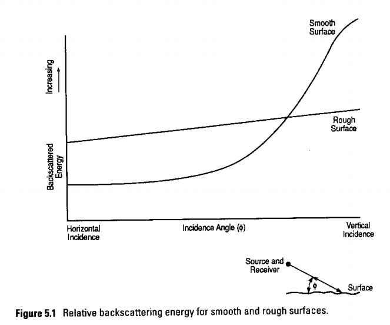

## 地空回波的参数定义

本节重点探讨杂波截面的计算方法，着重指出杂波截面会随不同参数变化呈现多个数量级的差异。由于杂波截面的精确计算难度较大，相关技术细节可参考文献中引用的资料。此外，雷达设计通常会采用客户指定的杂波参数量级。

点状目标的背向散射能量标准定义采用参数$$ \sigma_0$$，且假设目标截面与天线波束宽度无关。假设杂波截面与被照射面积呈线性关系，这隐含了地表均匀的假设。基于这些假设，结合图5.2所示的扁平地球几何模型，以及天线照射增益在该区域内保持恒定，在照射区域外为0的条件，则表面雷达截面$\sigma_s$为
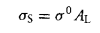
其中$A_L$为被照射区域，$\sigma^0$为归一化表面横截面，另一种定义为

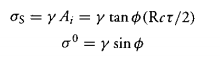

且部分论文以归一化参数σ⁰呈现结果，而其他研究则采用归一化参数γ。需特别注意的是，不同研究者使用的符号体系并不统一。本章所采用的符号代表学界主流观点。

通常认为影响散射截面大小的主要参数包括：

1. 地形类型（例如：海面和陆地）

2. 其他自然影响因素（例如：海况、相对风向、潮湿地面及干燥地面）

3. 载波频率

4. 传输极化

5. 接收极化

6. 俯仰角

7. 表面均匀性

### 海面回波

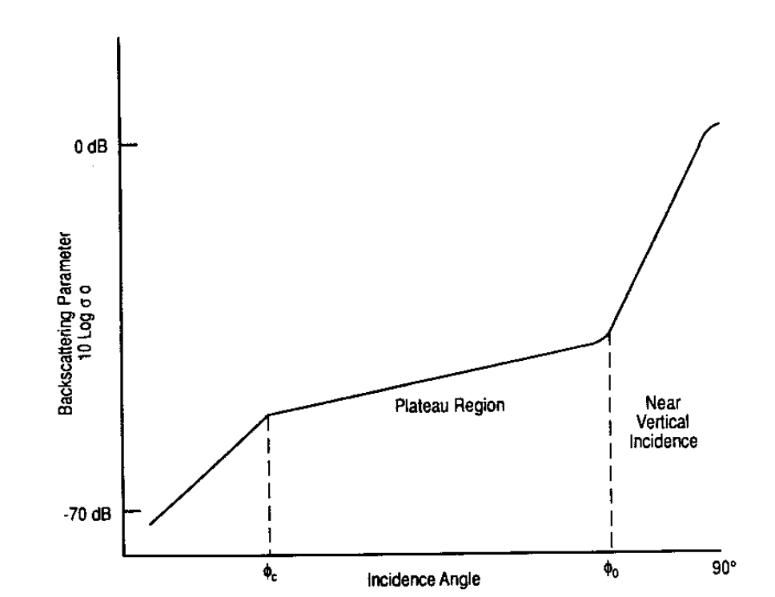

$\sigma^0$与入射角度的关系，其中两个分界点与频率和极化有关，得到

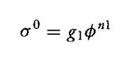

这个规律在高原地区大致适用

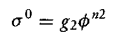

由$n_1$、$n_2$的数值以及$\phi_c$所显示的趋势具有重要意义。以下情况具有典型性：
#### 随着海面情况加剧

1. σ⁰ 在所有俯仰角下均呈现上升趋势。

2. φc值随海况增强而递减，典型值为最平静海况下的5度至最汹涌海况下的1度。

3. nl和n2的值分别保持在大约3.0和0.6的恒定值，因此将临界角φc处的σ度数值表示为$$ \sigma_c$$适用于小于φc的角度）。

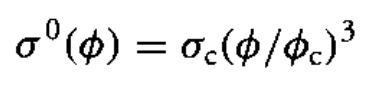

而对于高原地区

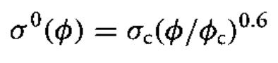

#### 随载波频率增加

1. σ 度随平静海面约以三次或四次方增加，随汹涌海面约以零次或一次方增加。

2. φc值随频率增加而减小。

3. nl 和 n2 的数值与频率无关。

需要注意的是，关于海况变化和频率变化的陈述2和3在形式上完全相同，并证实了先前所述的$$ \sigma_c$$对表面粗糙度的依赖性。

#### 极化敏感性

##### 极化与海面杂波的反射机制

* 海面的极化反射特性

海面作为粗糙表面，其对电磁波的反射依赖于极化方式（水平极化HH/垂直极化VV）：

垂直极化（VV）：电磁波电场方向与海面垂直，海浪波峰对垂直极化的散射较弱（能量更多被吸收或透射），反射率较低；

水平极化（HH）：电场方向与海面平行，与海浪波峰的水平结构匹配，散射更强，反射率较高。

关键结论：海面杂波的反射率系数σ⁰（面积反射率）对极化敏感，HH极化的σ⁰通常比VV极化高5\~15 dB（具体差异随海况和入射角变化）。

* 目标与杂波的极化差异

舰船等金属目标：通常对极化不敏感（或呈现各向异性，如细长结构仅反射特定极化）；

海面杂波：极化敏感性强，可通过选择极化方式抑制杂波（如采用VV极化降低海面回波强度）。

σ⁰（VV）/σ⁰（HH）的比值本质上与波浪倾角无关，但会随载波频率和海况变化而改变。其基本规律是：在平滑海面（如风平浪静的海域及微波频段低频段）时，σ⁰（VV）/σ⁰（HH）比值较大，通常在20-30分贝之间。随着海面粗糙度增加，该比值逐渐趋近于零，有时甚至会出现数分贝的负值。目前关于交叉极化背向散射截面的信息仍十分有限。

##### 影响极化敏感性的关键因素

* 海况等级

平静海面（海况1-2级）：表面较平滑，极化差异较小（HH比VV高5\~8 dB）；

大风浪（海况4-5级）：表面粗糙度增加，水平极化散射增强，极化差异扩大（HH比VV高10\~15 dB）。

* 入射角（擦地角）

小入射角（<10°）：接近掠射，镜面反射主导，极化差异最大（HH反射率远高于VV）；

大入射角（>30°）：漫反射主导，极化差异减小（HH与VV反射率接近）。

* 雷达频率

高频（如X波段，3 cm）：对表面粗糙度更敏感，极化差异更显著；

低频（如L波段，23 cm）：绕射效应强，极化差异较小。

##### 工程应用：极化滤波抑制海面杂波

* 极化选择策略

若目标为金属舰船（极化不敏感），可采用垂直极化（VV）发射/接收，降低海面杂波的σ⁰，从而提高目标与杂波的信噪比（SCR）。

示例：某X波段雷达在海况3级、入射角5°时，HH极化海面σ⁰=−18 dB，VV极化σ⁰=−28 dB，采用VV极化可使杂波RCS降低10 dB，显著改善目标检测性能。

* 双极化雷达技术

通过同时发射HH和VV极化波，测量两者回波的幅度比或相位差，进一步区分目标与杂波（如目标回波的极化比接近1，而杂波极化比>10 dB）。

### 地面杂波

各类地面散射信号的杂波回波幅值变化规律，其函数变化形式与海面反向散射能量的变化模式基本一致。具体而言，这种变化形式主要受表面粗糙度和工作频率的双重影响。反向散射系数的变化趋势，也与图5.1所示的函数变化规律高度吻合。

### 气象回波

雷达数据常被气象学家用于确定降水率和天气特征，这表明降水杂波回波的强度可被高度准确地预测。

杂波回波的总强度取决于波束截获的降水体积以及该降水类型的后向散射特性。因此，当方位角和仰角方向的天线波束宽度分别为 θA 和 θE 球面度，且距离分辨率为

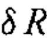

时，假设杂波完全填充该空间体积，其在距离R处的截获体积V可表示为

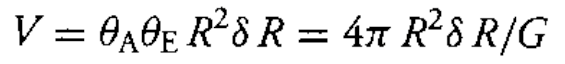

其中G为天线增益。假设各散射体呈球形且尺寸远小于波长，则单位体积的散射截面可推导为

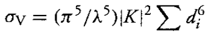

其中d\_i表示第i滴水的直径，求和范围涵盖该体积内的所有水滴。常数K通过实验确定，其数值为雨滴0.93、冰晶和雪0.2。当频率的四次方的倒数作为σv的函数时，这种变化源于瑞利近似法的有效性假设——该近似适用于波长远小于球体尺寸的散射情况。当波长小于3厘米时，该近似法的适用性将开始减弱。最终，该求和表达式可与降雨率建立关联如下

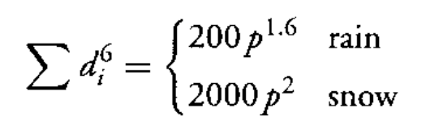

其中p表示降水量（单位：毫米/小时），即雪融化的等效速率。图5.4展示了这些关系的直观示意图。

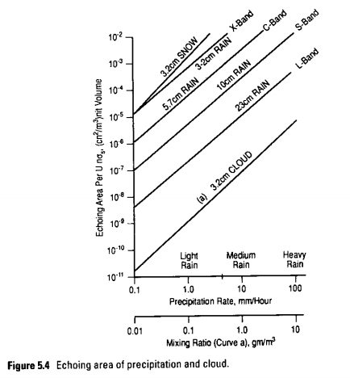

除了用于多普勒回波反射的标准技术外，有时还会采用偏振敏感技术来消除天气杂波干扰。经典做法是采用单极化模式进行收发。研究表明，当散射体为球形时，散射能量的偏振方向会与天线极化方向垂直，因此系统无法检测到雨滴等球形目标。由于目标的偏振散射特性与形状相关，其他散射体（如飞机）会发射与接收天线极化方向不垂直的电磁波，从而通过该技术提升散射系数。此外，偏振敏感技术在射频阶段实施，确保与多普勒技术兼容，两者的结合可产生比单独使用时更强的散射系数。

## 多普勒滤波技术

### 核心概念：多普勒处理的作用

多普勒处理的核心目的，是**在杂波（比如地面、海面的回波干扰）中更有效地检测出目标**。它的原理是利用目标和杂波之间的**多普勒频率差异**来区分二者。

* 目标（如飞机、导弹）会因为相对运动产生多普勒频移。

* 杂波（如静止的地面）的多普勒频率通常接近零。

### 实现方式：脉冲序列与相干处理

为了实现这一点，雷达会发射**N 个脉冲的序列**，并对这些脉冲的回波进行**相干处理**。

* **脉冲重复间隔（PRI，记为 T）**：两个脉冲发射之间的固定时间间隔。

* **延迟线抽头（tapped delay line）**：它的作用是让不同脉冲的回波在时间上对齐。这样，来自同一个距离单元、不同发射脉冲的回波就能被同步处理。

### 系统结构：MTI 与多普勒滤波器的共性

文中提到，这个延迟线结构既适用于**动目标指示（MTI）电路**，也适用于**多普勒滤波器**。

* 两者的硬件结构非常相似，主要区别在于**权重（weights）的设计逻辑**不同。

* 权重的选择决定了整个系统的**增益 - 多普勒频率特性**，也就是不同多普勒频率的信号会被放大或抑制多少。

### 两种电路的设计差异

#### 1. 动目标指示（MTI）电路

* **设计准则**：让增益特性在**特定多普勒频率处出现零点（null）**。

* 最常见的是在**零多普勒频率**处设置零点，目的是抑制静止杂波（如地面回波）。

* 这样可以让运动目标的回波被保留，而静止杂波被大幅削弱。

#### 2. 多普勒滤波器

* **设计准则有两个**：

  1. **目标匹配**：在目标的多普勒频率处，电路要有很强的响应（高增益）。

  2. **杂波抑制**：在远离目标多普勒频率的位置（比如杂波所在的频率），响应要尽可能小（低增益）。

* 简单来说，就是 “放大目标，抑制杂波”，并且是**针对性地放大特定多普勒频率的目标**。

***

### 一句话总结

这一节讲的是：如何通过对多个脉冲回波的相干处理，利用多普勒频移来区分目标和杂波；而 MTI 和多普勒滤波器是实现这一目标的两种具体技术，它们结构相似，但设计思路不同 ——MTI 是 “主动抑制杂波”，多普勒滤波器是 “主动增强目标”。

### MTI延迟线对消器

#### 一、 核心结构：单延迟单元对消器

这是最基础的MTI（动目标指示）电路，也叫**双脉冲对消器**。
* **输入输出关系**：
$$e_{\text{out}}(t) = \frac{e_{\text{in}}(t) - e_{\text{in}}(t-T)}{\sqrt{2}}$$

它的本质是将当前时刻的回波信号 $e_{\text{in}}(t)$与延迟一个脉冲重复间隔（PRI，记为 $T$）的回波信号$e_{\text{in}}(t-T)$相减，再做归一化处理。
* **物理意义**：
  * 对于静止目标（多普勒频率为0），两个脉冲的回波相位完全相同，相减后输出为0 → 这就是它能**抑制静止杂波**的原因。
  * 对于运动目标，两个脉冲的回波存在相位差 $ϕ$相减后会产生非零输出 → 从而保留动目标信号。
#### 二、 实现难点：RF延迟的不可行性
文中提到，这种延迟线在射频（RF）频段直接实现几乎不可能，原因是：
* 电缆的传播速度接近光速，要产生典型雷达（如PRF=300Hz，PRI≈3300μs）所需的延迟，需要约**1000公里长的电缆**，这在工程上无法实现。
* 因此，实际系统会在中频（IF）或基带实现延迟，后续章节会介绍这些实用方法。
#### 三、 相量图与多普勒频率的关系
用相量图（Phasor Diagram）可以直观理解对消器的工作原理：
1. 第一个脉冲的回波作为参考相量（相位设为0）。
2. 第二个脉冲的回波相量与第一个的相位差为 $\phi$,这个相位差由目标在两个脉冲间隔内的运动引起。
3) 相位差公式：
$$\phi = 2\pi f_D T$$
其中 $f_D = \frac{f_0 v}{c/2}$ 是目标的多普勒频率，$f_0$ 为雷达载频，$v$ 为目标速度，$c$ 为光速。
#### 四、 盲速与最优速度

从相位差公式和对消器的输出特性，可以引出两个关键概念：
1. **盲速（Blind Speeds）**
   * 当相位差 $\phi = 2n\pi$（n为整数）时，两个相量完全同相，相减后输出为0。
   * 此时目标会被当作静止杂波抑制掉，对应的多普勒频率为 $f_D = n \cdot \text{PRF}$（PRF为脉冲重复频率，$\text{PRF}=1/T$。
   * 这是MTI系统的固有缺陷，需要通过多脉冲对消或参差PRF来缓解。
1. **最优速度（Optimum Speeds）**
   * 当相位差 $\phi = (2n+1)\pi$ 时，两个相量完全反相，相减后输出最大。
   * 此时目标信号被最大程度保留，对应的多普勒频率为 $f_D = (n+0.5) \cdot \text{PRF}$。
#### 五、 传递函数与多普勒响应

对消器的传递函数为：
$|H(f)| = \sqrt{2} \left|\sin(\pi f_D T)\right|$
对应的多普勒响应曲线（图5.5(c)）是一个正弦平方型的周期性曲线：
* 在 $f_D = 0, \text{PRF}, 2\text{PRF}, \dots$处为零点（盲速）。
* 在 $f_D = \text{PRF}/2, 3\text{PRF}/2, \dots$ 处为峰值（最优速度）。
#### 六、 杂波的响应
杂波（如地面、树木）的平均多普勒频率为0，但由于风等因素，杂波内部存在微小的速度差异，导致其多普勒频谱在0附近有一定展宽。
* 对消器能有效抑制杂波的**平均分量**（零多普勒）。
* 但对杂波的**频谱展宽部分**抑制效果会减弱，这也是MTI性能的一个限制因素。
这一节介绍了最基础的MTI延迟线对消器：它通过相减两个脉冲的回波来抑制静止杂波，利用多普勒频率差异检测动目标；但它存在盲速缺陷，且RF延迟难以直接实现，实际系统需要更复杂的设计来克服这些问题。
### 杂波谱密度
#### 一、 核心概念：杂波功率谱密度 
杂波功率谱密度 $C(f)$描述了杂波回波的功率在不同多普勒频率上的分布情况。 
- 它的定义是：在频率 $f$ 处，带宽 $df$ 内的杂波功率为 $C(f) \, df$。 
- 当杂波经过滤波器（比如MTI对消器）时，输出的杂波总功率由下式计算： $p_{\text{CO}} = \int_{-\infty}^{+\infty} C(f) \cdot |H(f)|^2 \, df$ 这里 $|H(f)|^2$ 是滤波器在频率 $f$ 处的功率增益。 
#### 二、 杂波谱的来源与展宽 
杂波的频谱不是一个完美的冲激（集中在0多普勒频率），而是有一定的展宽，主要来自两个原因： 1. **自然运动（风等因素）** 
- 树木、海浪等杂波会因风产生微小运动，导致不同杂波单元有不同的多普勒频率。 - 表5.1给出了不同杂波源在不同风速下的速度标准差 $\sigma_v$。 
- 速度标准差可以通过公式（5.4）转换为**频率标准差**： $\sigma_f = \sigma_v \cdot \frac{f_0}{c/2}$ 其中 $f_0$ 是雷达载频，$c$ 是光速。 
2. **天线扫描** 
- 机械扫描雷达的天线增益会随时间变化，导致不同脉冲的回波幅度不同。 
- 这种幅度变化会让MTI对消器无法完全抑制杂波，等效于杂波频谱展宽。 
- 其等效频率标准差为： $\sigma_f = \frac{0.265 \cdot \text{PRF}}{N}$ 其中 $N$ 是驻留期间的脉冲数。 
#### 三、 杂波谱的形状 
文中指出，杂波谱近似为**高斯分布**，表达式为：$C(f) = \left[ \frac{P_C}{\sqrt{2\pi \sigma_f^2}} \right] \exp\left(-\frac{f^2}{2\sigma_f^2}\right)$ 
- $P_C$ 是杂波的总输入功率。 
- $\sigma_f$ 是杂波谱的频率标准差，决定了频谱的展宽程度。
#### 四、 滤波器与杂波谱的相互作用 
图5.6展示了双脉冲对消器的功率响应 $|H(f)|^2$ 和典型地面杂波谱 $C(f)$： 
- 杂波谱的峰值在**零多普勒频率**处。 
- 双脉冲对消器的响应在**零多普勒频率处正好是零点**，这使得输出杂波功率被大幅抑制。 
- 两者的乘积积分（公式5.3）就是最终的输出杂波功率，由于零点与峰值对齐，输出功率远小于输入功率。 
#### 五、 总杂波谱宽的合成 
当存在多种频谱展宽因素时，总谱宽由各因素的谱宽按**均方根（RMS**合成： $\sigma_f^2 = \sigma_{f1}^2 + \sigma_{f2}^2$ 例如，自然运动和天线扫描的展宽会叠加在一起，共同决定杂波谱的总宽度。 
这一节讲的是：杂波的功率在多普勒频率上不是集中在一点，而是呈高斯分布并有展宽，展宽来自风引起的自然运动和天线扫描等因素；MTI对消器的设计正是利用了杂波谱的峰值与滤波器的零点对齐，来最大限度抑制杂波输出功率。
