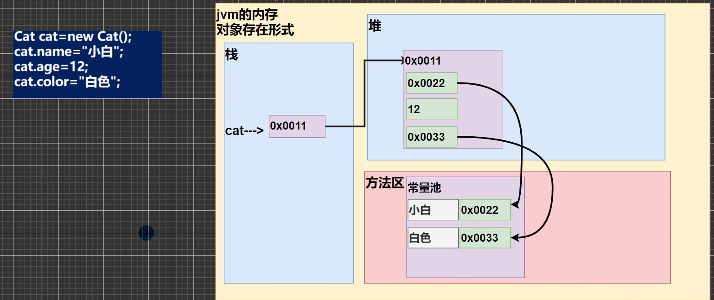
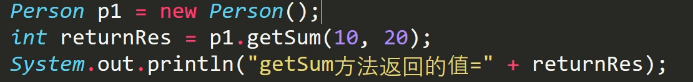
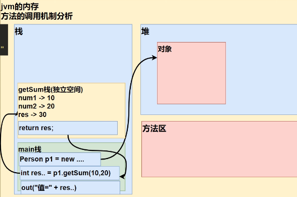

# Java基础学习
## Java概述
### JDK介绍


#### JDK
JDK全称（Java Development Kit Java开发工具包）

JDK=JRE+JAVA开发工具（java，javac，javadoc，javap等）

#### JRE
JRE（Java runtime environment Java运行环境）

JRE=JVM+Java核心类库[类]

## 变量
### 数据类型


1. long型需要在数值后面加上大写或小写的L，`long n1 = 1L;`
2. 浮点数=符号位+指数位+尾数位，尾数位可能丢失，造成精度的损失。
3. Java默认浮点常量为double，要声明float需要在数字后面加上f或F。

像这种情况，做比较运算要小心；应以两个数的差值在某个精度范围类判断。

#### 基本数据类型转换
分为自动类型转换和强制类型转换

自动类型转换：在赋值和运算时，精度小的类型自动转换为精度大的数据类型

char->int->long->float->double;

byte->short->int->long->float->double.

byte,short,char可以计算，但是会转换成int类型。

#### 基本数据类型和String类型的转换
1. 基本数据+类型->String，在变量后面加上“”即可。
2. String->基本数据类型

使用基本数据类型的包装类的相应方法得到基本数据类型


字符串转成字符含义指将字符串的第一个字符取到


### Java API
#### Java api中文文档
[https://www.matools.com/api/java8](https://www.matools.com/api/java8)

#### java类的组织形式


## 运算符
### 算术运算
a%b=a-a/b*b


### 逻辑运算符


+ 短路与&&与逻辑与&的区别：短路与若第一个变量为false，则不会判断第二个变量，效率更高。
+ 短路或与逻辑或同上。

### 赋值运算
+ 复合赋值运算会对变量进行类型转换


### 三元运算符
+ 基本语法


+ 案例演示


### 运算符优先级


### 键盘输入语句


```java
import java.util.Scanner;//导入相应的类
public class Input{
    public static void main(String[] args){
        Scanner myScanner = new Scanner(System.in);
        System.out.println("请输入名字");
        String name = myScanner.next();//字符串
        System.out.println("请输入年龄");
        int age = myScanner.nextInt();//整形
        System.out.println("请输入薪资");
        double sal = myScanner.nextDouble();//浮点型
        System.out.println("人员信息如下");
        System.out.println("名字是" + name + "年龄是" + age + 
                           "薪资是" + sal);
        char c1 = myScanner.next().charArt(0);//字符
    }
}
```

## 程序控制结构
### 顺序控制
程序从上至下执行，中间没有中断和跳转，程序默认的执行结构。

### 分支控制
if-else

switch分支


+ 细节

<font style="background-color:#FBDE28;">switch（表达式）中表达式返回值的类型必须为byte,shaort,int,char,enum(枚举),String</font>

<font style="background-color:#FBDE28;">case()中必须是常量或常量表达式</font>

<font style="background-color:#FBDE28;">default可有可无</font>

### 跳转控制语句
+ break：用于终止语句块的执行
+ continue：用于结束本次循环，继续执行下一次循环
+ return：	使用在方法，用于跳出所在的方法   注：若使用在main方法中，则结束程序
## 数组
- 数组是一种数据类型，是引用类型
- 可以通过如下代码得到数组的大小/长度
```
数组名.length
```
- 使用方式1动态初始化：数据类型 数组名[] = new 数据类型[大小]
- 使用方式2动态初始化：1.数据类型 数组名[]；2.数组名 = new 数据类型[大小]
- 使用方式3静态初始化：数据类型 数组名[] ={元素值，元素值，元素值...}
## 面向对象编程
### 类与对象
- 类是自己定义的一种数据类型，类具有属性和行为
对象是类的一个实例
==类是对象的模板，对象是类的一个个体，对应一个实例==
- ==类与对象在内存中存在的形式==

上图中，由于名字和颜色是字符串，属于引用类型，所以将实际内容存储在常量池中。
- 属性，又叫成员变量、
属性的定义语法同变量，示例：访问修饰符 属性类型 属性名；
其中访问修饰符的作用是控制属性的访问范围，有四种访问修饰符：public proctected 默认 private
- Java内存的结构
栈：一般存放基本数据类型（局部常量）
堆：存放对象，数组等
方法区：常量池（常量，比如字符串），类加载信息
### 成员方法
#### 方法概述
```java
	public void speak(){
		Sysytem.out.println("我是一个好人")
}
```
1. public 表示方法是公开
2. void 表示没有返回值
3. speak是方法名，（）是形参列表
4. {}是方法体，其中写需要执行的代码
调用时使用p1.speak()即可
#### 方法调用机制


1. 当执行到方法时，会开辟一个独立空间；
2. 当方法执行完成后，或执行到return时，就会返回
3. 返回到调用方法的地方
4. 返回后，继续执行后面的语句
5. 当方法调用完成后，独立空间释放；当main方法完成后，整个程序退出。
#### 成员方法的必要性
- 提高了代码的复用性
- 可以将实现的细节封装起来，然后供其他用户调用即可
#### 注意事项和使用细节、
- 同一个类中的方法调用，直接调用即可，不需要创建对象
- 跨类中的方法调用，需要通过对象名调用
### 方法传参机制
- 基本数据类型，传递的是值（值拷贝），形参的任何改变不影响实参
- 引用类型传递的是地址，可以通过形参影响实参
在使用引用类型时，例如数组，由于数组的值是一个地址，在调用方法时通过地址指向堆中的具体值，则在方法中对具体值进行改变后，原本的数组仍指向该空间，则数组的值发生改变。
### 方法的重载（OverLoad）
- 基本介绍
java中允许同一个类中，存在多个同名方法，但要求形参列表不同
- 优点
减轻了起名和记名的麻烦
- 要求
方法名必须相同，形参列表必须不同，返回类型无要求
### 可变参数
-  java 允许将同一个类中多个同名同功能但参数个数不同的方法，封装成一个方法，就可以通过可变参数实现
#### 基本语法
 访问修饰符 返回类型 方法名(==数据类型...== 形参名) {}
 使用可变参数时，可以当作数组来使用
#### 注意事项
 
 - 可变参数的实参可以为0个或多个
 - 可变参数的本质就是数组
 - 可变参数的实参可以是数组
 - 当可变参数与其他形参在一起时，必须放在最后
 - 一个形参列表只能出现一个可变参数
### 作用域
1.Java中，主要的变量是属性（成员变量）和局部变量
2.局部变量一般是在成员方法中定义的变量
3.作用域的分类：
全局变量：也就是属性，作用域为整个类体
局部变量：除了属性之外其他的变量，作用域为定义它的代码块中
4.全局变量可以不赋值，因为有默认值，而局部变量没有
5.全局变量可以加修饰符，局部变量不可用
### 构造器/构造方法
#### 基本介绍
构造方法又称构造器（constructor），是类的一种特殊方法，它的主要作用是完成对新对象的初始化。有以下特点
- 方法名和类名相同
- 没有返回值，但不能写void
- 在创建对象时，系统会自动调用该类的构造器完成对象的初始化
### 基本语法
```java
[修饰符] 方法名(形参列表){
方法体;
}
```

